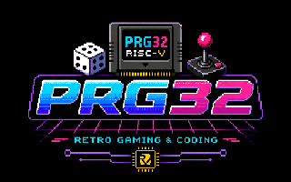

# PRG32
<p align="center">
  
</p>

PRG32 is an open-source educational runtime for teaching RISC-V assembly and C programming in undergraduate computer architecture and systems courses. PRG32 exposes a minimal interface built around the init/update/draw game loop.

PRG32 provides an entire retro-gaming environment to run native RV32IMAC machine code on the Espressif ESP32-C6, a commercially available microcontroller. The platform includes embedded firmware, a .prg32 cartridge format and toolchain, a QEMU-based desktop emulator and can be used in combination with the Cartridge Store, a server providing app-store-style distribution, multiplayer relay, score tracking, and frame-level metrics collection.

PRG32 is **not** a CPU instruction emulator. Code runs natively on ESP32-C6 hardware, or on Espressif QEMU firmware target ESP32-C3 for desktop graphics/testing.

## Academic Profile

- Project domain: Embedded Systems and Computer Architecture Education
- Platform focus: ESP32-C6 (hardware) and ESP32-C3 QEMU path (desktop emulation)
- Course style: first-year/early undergraduate assembly and systems labs
- Academic supervisor / project lead: Raffaele Montella - UniParthenope
- Contributor (student): Simone Boscaglia - UniParthenope - Computer Science student
- Contributor (student): Ivan Cafiero - UniParthenope - Computer Science student

## Install & Setup

> **Note**: For a detailed guide on setting up your environment, see [getting_started_game_development.md](docs/getting_started_game_development.md).

<details>
<summary><strong>macOS Setup</strong></summary>

Install dependencies:
```bash
brew install git cmake ninja dfu-util ccache libusb python
```

Install ESP-IDF:
```bash
cd $HOME
git clone -b v5.4 --recursive https://github.com/espressif/esp-idf.git
cd esp-idf
./install.sh esp32c3,esp32c6
. ./export.sh
```

Clone the project:
```bash
git clone https://github.com/riscv-prg32/PRG32
cd PRG32
```
</details>

<details>
<summary><strong>Linux Setup</strong></summary>

Install dependencies (Debian/Ubuntu):
```bash
sudo apt update
sudo apt install -y git wget flex bison gperf python3 python3-venv python3-pip cmake ninja-build ccache libffi-dev libssl-dev dfu-util libusb-1.0-0
```

Install ESP-IDF:
```bash
cd $HOME
git clone -b v5.4 --recursive https://github.com/espressif/esp-idf.git
cd esp-idf
./install.sh esp32c3,esp32c6
. ./export.sh
```

Clone the project:
```bash
git clone https://github.com/riscv-prg32/PRG32
cd PRG32
```

Linux serial permissions:
```bash
sudo usermod -aG dialout "$USER"
```
Log out and back in after changing group membership.

#### Notes
ESP32-C6 boards usually appear as `/dev/ttyACM0`; USB serial adapters may appear as `/dev/ttyUSB0`. If the board is visible but flashing fails, check `dialout` membership and
reconnect the USB cable after logging in again.

</details>

<details>
<summary><strong>Windows Setup</strong></summary>

1. Download and run the Espressif ESP-IDF Tools Installer for Windows.
2. Select an ESP-IDF 5.4 or newer release.
3. Include support for `esp32c3` and `esp32c6`.
4. Open the "ESP-IDF PowerShell" shortcut created by the installer.
5. Clone and build PRG32 from that shell:

```powershell
cd $HOME\Documents
git clone https://github.com/riscv-prg32/PRG32
cd PRG32
```

#### Notes
- Use the ESP-IDF PowerShell or ESP-IDF Command Prompt, not a plain terminal
where `idf.py` has not been exported.
- If flashing fails, check Device Manager for the ESP32-C6 serial port and pass
  it explicitly with `-p COMx`.
- If PlatformIO Monitor cannot open the port, close Arduino Serial Monitor,
  ESP-IDF Monitor, and every other terminal using the same COM port.
</details>

<details>
<summary><strong>PlatformIO Setup (Alternative)</strong></summary>

While ESP-IDF standalone is the primary and recommended way to install and build PRG32, you can also use PlatformIO. Open the repository root in PlatformIO. The checked-in `platformio.ini` default environment targets the ESP32-C6.

**CLI Setup (Linux/macOS):**
```bash
python3 -m venv .venv-platformio
. .venv-platformio/bin/activate
python3 -m pip install platformio
pio run
pio run -t upload
pio device monitor -b 115200
```

**VS Code Setup (Windows):**
1. Install Git for Windows.
2. Install Visual Studio Code.
3. Install the Espressif ESP-IDF extension for VS Code.
4. Install the PlatformIO extension for VS Code.
5. Install the Microsoft C/C++ and Python extensions.

- Use the checked-in `PRG32.code-workspace` for student labs; paths are
  workspace-relative.
  
**CLI Setup (Windows):**
```powershell
cd $HOME\Documents\PRG32
pio run
pio run -t upload
pio device monitor -b 115200
```

The ESP32-C6 build keeps UART0 as the primary ESP-IDF console and enables
native USB Serial/JTAG as a secondary output for PlatformIO Monitor. A healthy
boot logs the configured `prg32_lcd` ILI9341 pins before drawing the splash.

The PlatformIO environment is for the physical ESP32-C6 classroom board. Keep
using the `idf.py` commands in `docs/qemu.md` for QEMU screen builds.
</details>

## Startup

The first screen is the startup menu, where you can, among other things, run a cartridge, set the default boot cartridge, configure Wi-Fi, configure CartridgeStore access, browse the store and download new cartridges, open the audio setup menu, open the developer status-band menu, launch the unattended performance test, or show the about screen.

**Navigation Commands:**
- **Joystick**: Navigate menus
- **Button A (SET)**: Confirm selection
- **Button B (RST)**: Go back
- **A + B + DOWN (Hold)**: Restart the PRG32 firmware
- **A + B (Hold during boot)**: Force enter setup (also happens automatically on first boot when no cartridge is stored)

Setup screens also show the active Wi-Fi mode and current IP address.

## PRG32 Tooling
You can use the python tooling `python -m prg32` inside the PRG32 directory to execute commands.
If you are not using PlatformIO, remember to always source the file `export.sh` in the ESP-IDF directory you previously created before using PRG32 in a new shell. 

It is recommended for users to create an alias for sourcing ESP-IDF and using the PRG32 tools:
```bash
alias get_idf=". $HOME/esp-idf/export.sh"
alias prg="python -m prg32"
```

You can run `python -m prg32 --help` to learn about other commands provided.

<details>
<summary><strong>Running PRG32 on the ESP32C6</strong></summary>

If you have the physical PRG32 hardware, after [completing the hardware setup](docs/hardware.md) you can build the project for the ESP32C6 and flash it to the SoC:
```bash
python -m prg32 esp32c6 build-and-flash
```

Now that PRG32 is running, you have multiple options to run your first cartridge:
- Setup the [Cartridge Store](docs/cartridge_store.md) and download one of the availables cartridge
- Download or create your own cartridge and upload it via `python -m prg32 esp32c6 upload`.
</details>

<details>
<summary><strong>Running PRG32 on QEMU</strong></summary>

If you don't have the physical hardware you can still use the PRG32 framework emulated on QEMU:
```bash
python -m prg32 qemu build
```

You can run the QEMU emulator to make sure everything is working correctly:
```bash
python -m prg32 qemu run
```

You have multiple options to run your first cartridge:
- Setup the [Cartridge Store](docs/cartridge_store.md) and download one of the availables cartridge
- Download or create your own cartridge; upload it via `python -m prg32 qemu upload` and run it via `python -m prg32 qemu run`. 

IMPORTANT: To interact with the QEMU emulator, your active window must be the terminal that launched QEMU where you can see the logs.
</details>

<details>
<summary><strong>Building and inspecting cartridges</strong></summary>

The PRG32 repository comes with many example cartridge source codes. Here is an example of how to build the cartridge of the game "Asteroids" via the PRG32 tooling.

```bash
python3 -m prg32 cartridge build \
  examples/games/asteroids/graphics/game.S \
  --portable \
  --entry-prefix asteroids_graphics \
  --name asteroids \
  --out build-qemu/asteroids.prg32

python3 -m prg32 upload-qemu build-qemu/asteroids.prg32 --flash build-qemu/qemu_flash.bin
```

You can specify an architecture with the `--architeture [esp32c6,qemu]` option.
</details>

## Documentation Index

**Guides & Workflows:**
- [Getting Started / Game Development](docs/getting_started_game_development.md): End-to-end setup and manual.
- [Deployment Guide](docs/deployment.md): Build, flash, monitor, setup mode, and QEMU.
- [QEMU Virtual Screen](docs/qemu.md): Desktop testing and troubleshooting.
- [Cartridges](docs/cartridges.md): The `.prg32` build/upload workflow.
- [Hardware & Pinouts](docs/hardware.md): Board, display, and input architecture.

**Learning Materials:**
- [Teaching with PRG32](docs/teaching_with_prg32.md): Instructor notes and classroom setup.
- [Assembly Tutorial](docs/tutorial.md) | [C Tutorial](docs/tutorial_c_game.md)
- [Labs Overview](docs/labs/README.md)
- [Example Games](docs/examples.md)

**APIs & Advanced Features:**
- [Framework C/Assembly ABI](docs/framework_manual.md)
- [HTTP APIs (Score, Metrics, Multiplayer)](docs/api.md)
- [Audio Guide](docs/audio.md)
- [Assets Tools](docs/assets.md)

**Additional References:**
- [Repository Structure](docs/repository_structure.md)
- [Troubleshooting](docs/troubleshooting.md)
- [Legacy Firmware Guide](docs/publishing_and_flashing_legacy_firmware.md)

## Contributors

- Raffaele Montella - UniParthenope - academic supervisor / project lead
- Simone Boscaglia - UniParthenope - Computer Science student
- Ivan Cafiero - UniParthenope - Computer Science student

See [CONTRIBUTORS.md](CONTRIBUTORS.md) for contributor metadata suitable for academic submissions.

## Citation

For reports, theses, or coursework submissions, use the citation metadata in [CITATION.cff](CITATION.cff).
