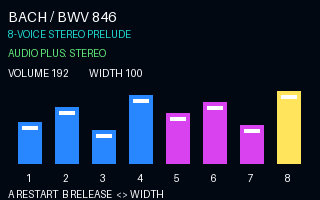

# PRG32 Bach Stereo Showcase

An advanced, store-ready PRG32 classical-audio cartridge for the
`development-c6` branch. It performs a compact original chiptune arrangement
of J. S. Bach's *Prelude in C major*, BWV 846, using only PRG32's procedural
audio instruments—there are no copied recordings, samples, or modern score
assets.

The cartridge demonstrates:

- eight concurrent tracker channels in a wide stereo soundstage;
- triangle, saw, pulse, and deterministic-noise oscillators;
- distinct ADSR envelopes, pulse widths, low-pass cutoffs, and resonances;
- per-channel pan and volume events, moving stereo echoes, and mono collapse;
- runtime master-volume control and audio-mode reporting;
- a descriptor-only AUDIO block with no PCM waveform payload.



[Download the 30-second MP4 preview with stereo audio](assets/preview.mp4).

## Controls

| Control | Action |
|---|---|
| A / SELECT | Restart the complete performance |
| B | Release all eight voices |
| Left / Right | Narrow or widen the stereo image |
| Up / Down | Raise or lower master volume |

The display shows playback progress, eight channel meters, the current audio
mode, volume, and stereo width. Stereo movement is audible on PRG32 Audio Plus;
the same cartridge folds down safely on mono hardware.

## Build

Use a sibling checkout of `riscv-prg32/PRG32` on branch `development-c6`, or
set `PRG32_REPO`:

```sh
git clone --branch development-c6 https://github.com/riscv-prg32/PRG32.git
export PRG32_REPO=/path/to/PRG32
./scripts/build.sh esp32c6
./scripts/build.sh qemu
```

Outputs are written to `dist/bach-stereo-showcase-<architecture>.prg32`.
The script first regenerates `assets/audio.json`, packs the AUDIO block, builds
a portable cartridge, and attaches metadata and artwork.

Upload to hardware:

```sh
PYTHONPATH="$PRG32_REPO" python3 -m prg32 esp32c6 upload \
  dist/bach-stereo-showcase-esp32c6.prg32 \
  --url http://192.168.4.1
```

## Validate

```sh
./scripts/test.sh
```

Validation checks the generated tracker score, all four waveform families,
eight-channel use, stereo bounds, note balance, metadata, and C syntax. A real
`.prg32` binary requires the RISC-V compiler installed by the PRG32/ESP-IDF
toolchain; the source bundle itself is platform-independent.

The root GitHub Actions workflow runs these checks, validates the screenshot
and audiovisual preview, builds both architecture variants, and retains them
in the downloadable `bachdemo-cartridge-package` artifact for 14 days.

## Copyright and provenance

Johann Sebastian Bach died in 1750; BWV 846 is public domain worldwide. This
repository contains a newly encoded, deliberately compact musical arrangement,
not a scan, edition, MIDI file, sample, or recording made by another party.
The code, arrangement data, metadata, and original vector artwork in this
package are released under the MIT License.
