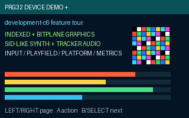

# PRG32 Device Demo+

`cartridges/devicedemo` is the in-tree, improved successor to [`riscv-prg32/DeviceDemo`](https://github.com/riscv-prg32/DeviceDemo), targeting the PRG32 `development-c6` branch.

It is a normal portable `.prg32` cartridge and Cartridge Store package, not setup-firmware-only diagnostics.



## Demonstration pages

1. Runtime overview and diagnostic overlay
2. Player 1 / player 2 / external-controller input
3. RGB565 framebuffer primitives and clipping
4. **New:** compact 4-bpp indexed sprites
5. **New:** bitplane sprite drawing
6. Tiles, dual playfields, camera and parallax
7. Platform/collision helper API
8. **New:** SID-like triangle/saw/pulse/noise synthesis, ADSR, panning and tracker events
9. Legacy beep/tone/note compatibility
10. Portable frame/input diagnostics
11. WiFi and scoreboard state (read-only demonstration)

The multiplayer service is documented and surfaced as a supported runtime service; the cartridge deliberately avoids creating network sessions automatically because DeviceDemo must remain safe as a smoke-test cartridge.

## Build

From a `development-c6` checkout, this directory is already under `cartridges/devicedemo`:

```sh
export PRG32_REPO=/path/to/PRG32
export PRG32_ARCHITECTURE=esp32c6
cartridges/devicedemo/scripts/build.sh
```

Build the QEMU variant by changing `PRG32_ARCHITECTURE=qemu`. Then run `scripts/pack-store-bundle.sh` after both binaries exist.

See `docs/build-and-publish.md` and `docs/feature-matrix.md`.

Procedural instruments and the tracker are packaged in `audio.json` as an AUD0
block, so the cartridge uses only portable ABI calls at runtime.

Button-triggered audio actions are edge-based: one physical press produces one
action. On the synth page, B stops the tracker without navigating away. The
resident runtime presents the framebuffer after `devicedemo_draw()` returns.

## CI/CD

The root GitHub Actions workflow runs the source/metadata checks, builds both
portable architecture variants, verifies their metadata and bundle ZIP, and
uploads `devicedemo-cartridge-package` for 14 days. Store publication is kept
separate because it requires credentials and is a release decision.
