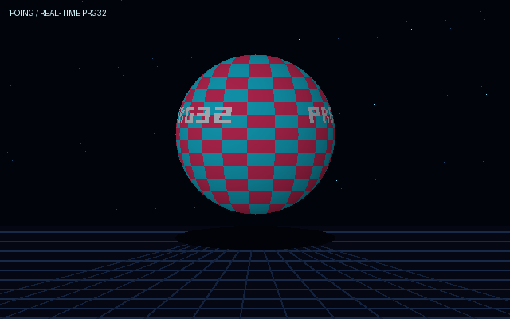

# Poing — PRG32 real-time graphics showcase

Poing is an original, high-load graphics cartridge inspired by the technical spirit of the classic Amiga bouncing-ball demo. It uses no Amiga artwork: the sphere, wrapped **PRG32** block wordmark, lighting, shadow, star field, and perspective grid are generated from integer math every frame.



[Download the 30-second MP4 preview with original stereo audio](assets/preview.mp4).

## Controls

| Control | Effect |
|---|---|
| Joystick left/right | Orbit the viewpoint |
| Joystick up/down | Raise/lower the viewpoint |
| A | Cycle three camera distances / ball sizes |
| B | Freeze/resume time while retaining camera control |
| SELECT | Toggle the HUD |

## What it stresses

- Per-scanline sphere intersection with integer square roots
- Perspective texture coordinates and rotating logo/checker texture
- Quantized RGB565 directional lighting
- Run-length coalescing into many one-pixel-high `prg32_gfx_rect` spans
- Perspective floor, moving depth grid, shadow, stars, and HUD in the same frame
- Recursive graphics locking around the full composite

The implementation deliberately avoids pre-rendered animation frames, floating point, heap allocation, and platform-private framebuffer access. See `docs/architecture.md` for the rendering pipeline and performance tradeoffs.

## Build

From a checkout of PRG32's `development-c6` branch, with its Python tooling and RISC-V toolchain available:

```sh
./build.sh /path/to/PRG32 esp32c6
./build.sh /path/to/PRG32 qemu
```

The portable, metadata-enriched cartridges are written to `dist/`. Upload with:

```sh
python3 -m prg32 esp32c6 upload dist/poing-esp32c6.prg32 --url http://192.168.4.1
```

Run the host validation without ESP-IDF:

```sh
./tests/run.sh
```

The root GitHub Actions workflow validates the renderer and media, builds both
architecture variants, and retains the packages and downloadable media in the
`poing-cartridge-package` artifact for 14 days.

## Compatibility

Targeted at PRG32 `development-c6`, cartridge ABI 1.1, 320×200 centered game viewport. Entry prefix: `poing`.

## Originality

“Boing” is referenced only as historical inspiration for a real-time bouncing sphere demonstration. The code, palette, layout, procedural PRG32 wordmark, and generated catalog artwork in this project are original and licensed under MIT.
