# Measuring PRG32 For A Scientific Paper

This tutorial explains how to collect reproducible PRG32 measurements suitable
for a course report, workshop paper, thesis appendix, or conference artifact.
It uses the optional PRG32 metrics pipeline, the screenshot API, and a fixed
experiment log so another student or reviewer can repeat the work.

## 1. Define The Research Question

Start with a narrow question. Good PRG32 questions are observable and repeatable:

- How much frame time is spent in `update`, `draw`, and `present` for each demo?
- Does QEMU produce the same visual output as the ESP32-C6 board?
- How much does enabling Wi-Fi upload affect frame stability?
- Which game examples stay below the 30 FPS frame-work budget?

Write the question before measuring. Then write one expected result and one
possible reason the result might be wrong.

## 2. Freeze The Software State

Record the exact source revision and build configuration:

```bash
git status --short
git rev-parse HEAD
git diff --stat
```

For a paper, commit the firmware and tools used for the experiment. If you must
measure with local changes, save the patch:

```bash
git diff > experiment.patch
```

Record:

- repository commit hash
- ESP-IDF version
- PlatformIO platform version, if PlatformIO is used
- target mode: ESP32-C6 hardware or ESP32-C3 QEMU
- display backend: ILI9341 or QEMU RGB
- metrics configuration
- cartridge name and build command

## 3. Prepare The Metrics Server

Clone the standalone metrics server next to the PRG32 repository, then create a
Python environment and start it. The commands below assume `PRG32` and
`MetricsServer` are sibling directories:

```bash
cd ..
git clone https://github.com/riscv-prg32/MetricsServer.git
cd MetricsServer
python3 -m venv .venv
. .venv/bin/activate
python3 -m pip install -r requirements.txt
python3 app.py --host 0.0.0.0 --port 8080
```

Keep the terminal open. The default database is:

```text
../MetricsServer/metrics.db
```

Use one database per experiment series, or copy the database after each series:

```bash
cp ../MetricsServer/metrics.db data/metrics_series_01.db
```

## 4. Build Firmware With Metrics Enabled

Use the normal ESP32-C6 defaults plus the metrics profile:

```bash
idf.py -B build-esp32c6-metrics \
  -D SDKCONFIG=build-esp32c6-metrics/sdkconfig \
  -D SDKCONFIG_DEFAULTS="sdkconfig.defaults;sdkconfig.defaults.metrics" \
  set-target esp32c6

idf.py -B build-esp32c6-metrics \
  -D SDKCONFIG=build-esp32c6-metrics/sdkconfig \
  -D SDKCONFIG_DEFAULTS="sdkconfig.defaults;sdkconfig.defaults.metrics" \
  build
```

Set these values in `sdkconfig.defaults.metrics` or through `menuconfig`:

```text
CONFIG_PRG32_METRICS_ENABLE=y
CONFIG_PRG32_METRICS_SERVER_URL="http://<server-ip>:8080"
CONFIG_PRG32_METRICS_BOARD_ID="lab-board-01"
CONFIG_PRG32_METRICS_SAMPLE_PERIOD_FRAMES=1
CONFIG_PRG32_METRICS_UPLOAD_PERIOD_MS=5000
CONFIG_PRG32_METRICS_QUEUE_LEN=512
```

For QEMU, use the QEMU build directory and decide whether the experiment is a
display benchmark, game-logic benchmark, or screenshot-comparison benchmark.
Always report this choice.

## 5. Flash Or Start The Runtime

For ESP32-C6 hardware:

```bash
idf.py -B build-esp32c6-metrics \
  -D SDKCONFIG=build-esp32c6-metrics/sdkconfig \
  -D SDKCONFIG_DEFAULTS="sdkconfig.defaults;sdkconfig.defaults.metrics" \
  flash monitor
```

For QEMU screen testing:

```bash
idf.py -B build-qemu \
  -D SDKCONFIG=build-qemu/sdkconfig \
  -D SDKCONFIG_DEFAULTS=sdkconfig.defaults.qemu \
  qemu --graphics monitor
```

Wait until the runtime splash and setup screen are visible. Note the IP address
shown by setup mode. Confirm that the metrics server URL is reachable from the
runtime network mode you selected.

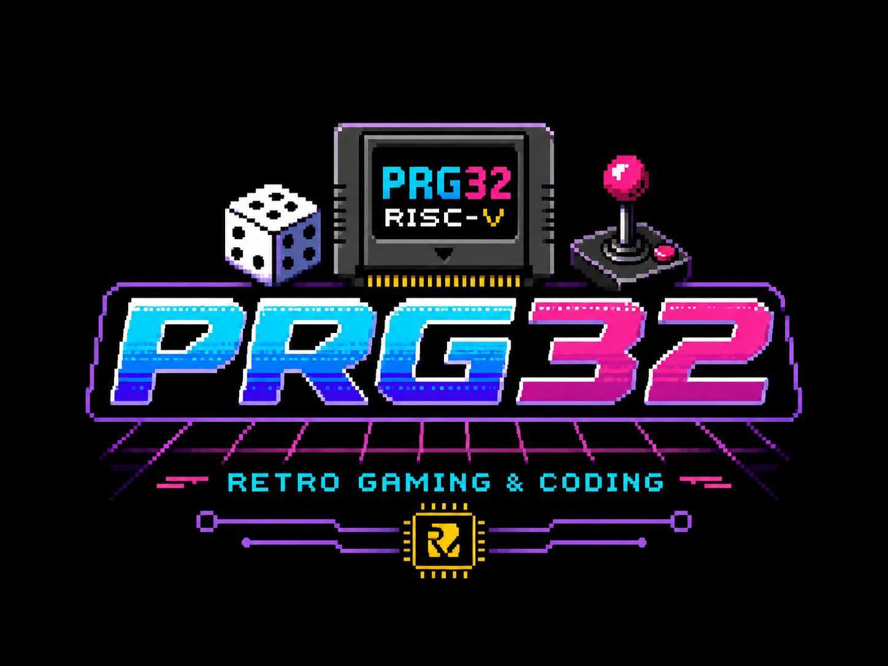

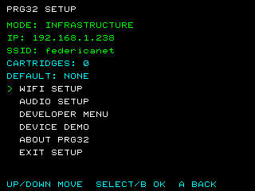

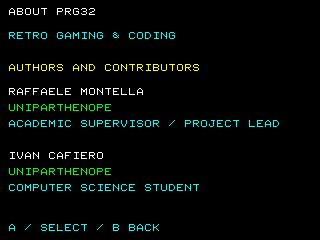

## 6. Build A Cartridge

Use the same cartridge build command for every run in the series. Example:

```bash
python3 tools/prg32_game.py build \
  examples/games/pong/graphics/game.S \
  --firmware-elf build-esp32c6-metrics/PRG32.elf \
  --entry-prefix pong_graphics \
  --name pong \
  --out build-esp32c6-metrics/pong.prg32
```

Upload it to the board:

```bash
python3 tools/prg32_game.py upload \
  build-esp32c6-metrics/pong.prg32 \
  --url http://192.168.4.1
```

For QEMU:

```bash
python3 tools/prg32_game.py upload-qemu \
  build-qemu/pong.prg32 \
  --flash build-qemu/qemu_flash.bin
```

## 7. Run The Measurement

Use the same procedure for every game:

1. Reboot the runtime.
2. Start the selected cartridge.
3. Wait 5 seconds so startup transients are not mixed with steady gameplay.
4. Play or drive the game for a fixed time, for example 60 seconds.
5. Use the same input script or the same human input protocol for each run.
6. Stop the run or switch cartridge only after the fixed time ends.
7. Record run notes immediately.

Recommended minimum repetition:

- 5 runs per game for classroom reports
- 10 runs per game for thesis or paper tables
- 30 runs per condition when comparing two implementations statistically

Record environmental details:

- board name
- power source
- display type
- Wi-Fi mode
- distance from access point
- server machine operating system
- room temperature if hardware stability is under study

## 8. Capture Screenshots

Use the screenshot API to document what was measured:

```bash
curl http://192.168.4.1/api/screenshot.bmp --output data/pong_run01.bmp
```

For each figure in a paper, write a caption that states the target, backend, and
game state. The reference screenshots below are examples of documentation-grade
figures for PRG32 demos and games.

| Demo | Screenshot |
|---|---|
| Pong | 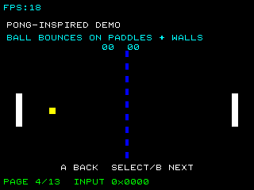 |
| Breakout | 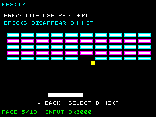 |
| Space Invaders | 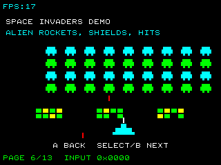 |
| Pacman | 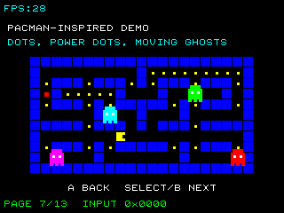 |
| Tetris | 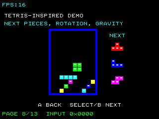 |
| Pole Position | 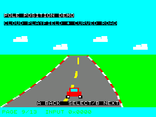 |
| Asteroids | 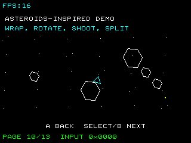 |
| Platform game | 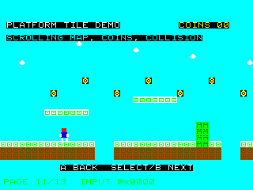 |
| Doom-style raycaster | 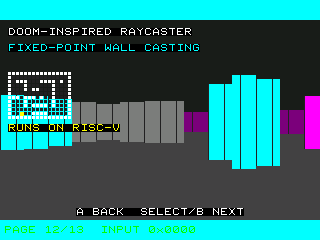 |
| Wing Commander-style dual playfield | 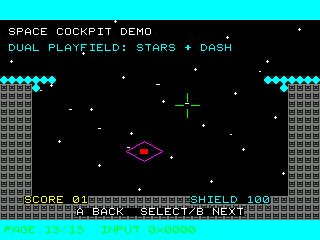 |

## 9. Export Metrics

For the built-in unattended benchmark, use setup mode:

1. Enter setup mode.
2. Select `PERFORMANCE TEST`.
3. Do not press any buttons while the automatic measurement screens run.
4. Wait until the summary screen appears.
5. Download the latest in-RAM metrics file:

```bash
curl http://192.168.4.1/api/performance.json \
  --output data/prg32_performance_run01.json
```

If the board is connected in infrastructure mode, replace `192.168.4.1` with
the IP address shown at the top of setup mode. The JSON is cleared by reboot and
is replaced when a new performance test is run, so archive it immediately after
each run. The JSON includes raw frame samples, one-second aggregate windows, and
`screen_summaries` for the clear/fill, text overlay, sprite storm, scrolling,
and mixed-gameplay screens.

Create paper-ready artifacts:

```bash
python3 tools/prg32_metrics_paper.py data/prg32_performance_run01.json \
  --out data/paper/prg32_performance_run01 \
  --dpi 300
```

This produces LaTeX tables, captions, normalized CSV/JSON data, and
high-resolution frame-time, stage-time, heap-stability, and per-screen
comparison charts.

For streaming cartridge metrics, use the metrics server workflow.

List runs:

```bash
curl http://127.0.0.1:8080/api/runs
```

Export a run:

```bash
python3 ../MetricsServer/export_run.py <run-id> \
  --db ../MetricsServer/metrics.db \
  --out data/exports/<run-id>
```

The export directory contains:

- `metadata.json`
- `samples.csv`
- `summary.csv`
- `table_summary.tex`
- `report.md`
- `frame_time_timeseries.png` and `frame_time_cdf.png` when matplotlib is available

Store raw exports. Do not edit `samples.csv` by hand.

## 10. Analyze The Data

Use `summary.csv` for quick tables and `samples.csv` for detailed analysis.
For the setup-mode JSON workflow, use `table_summary.tex`, `table_windows.tex`,
and the generated PNG figures directly in the draft paper after checking labels
and captions.
For each run, report:

- sample count
- average frame work time
- median frame work time
- p95 frame work time
- p99 frame work time
- frame-time jitter
- maximum frame work time
- average update time
- average draw time
- average present time
- deadline-miss count
- dropped-sample count

For a 30 FPS target, the active-work budget is about 33333 us. A frame can still
look stable if the active work is lower than this budget and the runtime waits
for the frame target.

## 11. Write The Paper Section

A concise methods section can follow this structure:

```text
We measured PRG32 firmware revision <hash> on <target>. Firmware was built with
ESP-IDF <version> and metrics enabled using <configuration>. Each cartridge was
run for <duration> seconds after a <warmup> second warmup. The metrics server
stored update, draw, present, heap, input, and deadline fields in SQLite. Each
condition was repeated <n> times. We report median and p95 frame-work time, and
we include dropped-sample counts as a data-quality indicator.
```

For results, include:

- one table of summary statistics
- one CDF or box plot of frame work time
- one screenshot per representative game state
- one paragraph explaining anomalies

## 12. Reproducibility Checklist

Attach or archive:

- repository commit hash
- `sdkconfig` or `sdkconfig.defaults.metrics`
- cartridge source and `.prg32` image
- metrics database or exported CSV files
- screenshot BMP/PNG files
- exact commands used to build, flash, run, and export
- notes about failed runs or dropped samples

## 13. Common Pitfalls

- Measuring the first seconds of boot instead of steady gameplay.
- Comparing ESP32-C6 hardware runs with QEMU runs without labeling the backend.
- Ignoring dropped samples when Wi-Fi is unstable.
- Reporting only average FPS while hiding p95 and maximum frame work time.
- Changing a game or firmware file between repetitions.
- Forgetting to rebuild cartridges after the resident firmware changes.

The goal is not to make PRG32 look perfect. The goal is to make the measurement
honest, inspectable, and repeatable.
